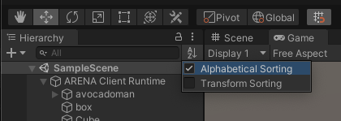

# ARENA-unity
Unity C# library for editing scenes and creating applications for the ARENA.
An early version was based on Olivia Lynn's demo: https://github.com/OliviaLynn/Unity-UDP-ARENA-Demo.
**This is a Work-In-Progress.**


## Documentation
- ARENA Auth/Messaging: https://arena.conix.io
- Google Auth: https://googleapis.dev/dotnet/Google.Apis.Auth/latest/api/Google.Apis.Auth.html
- Paho MQTT: https://m2mqtt.wordpress.com/m2mqtt_doc

## Library Usage:
1. Open a new or existing Unity project. **Unity 2019.1+ supported.**
1. Open `Edit > Project Settings > Player > Other Settings`.
1. Change `Scripted Define Symbols` to include: `SSL`.
1. Change `Api Compatibility Level` to: `.NET 4.x`.
1. Open `Window > Package Manager` and `+ > Add package from git URL...`, use this link:
    ```
    https://github.com/conix-center/ARENA-unity.git#0.0.9
    ```
1. Create an empty GameObject to use as ARENA client root, rename it to something meaningful, like: `ARENA`.
1. Select the `ARENA` GameObject and press `Add Component` to add the `ArenaClient` script.
1. Modify the the inspector variables for the `ArenaClient` script to change **host, scene, namespace** as you wish.
1. Press **Play**.
1. The auth flow will open a web browser page for you to login, if you haven't yet.

## Runtime (Play)
See [operational documentation](Documentation/arena.unity.md).

### Navigation
You can use the `Scene` or `Game` tabs to navigate.
- **Scene**: Use the Unity controls, https://docs.unity3d.com/Manual/SceneViewNavigation.html
- **Game**: Set the Unity Editor option `Camera Auto Sync` to true, enter the ARENA scene web page, then navigation in the ARENA will also move the `Game` view.

### Sorting Objects
1. Settings:`Edit > Preferences > General > Enable Alpha Numeric Sorting`
1. Change the sorting mode with top right button of the `Hierarchy` window.
    

### Signin
In the Unity Editor, pressing `Play` will begin the signin authorization flow.

### Signout
Two options:
- **Editor:** Select the menu item `ARENA > Signout`.
- **Runtime:** Click the `Signout` button on the `ArenaClient` Component.

## Architecture
- The `.NET 4.x` API level is required since ARENA JSON payloads are fluid, and we cannot keep up with schema serialization definitions by developers and users. So we use the `dynamic` object instantiations offered in the .Net 4 API to test for JSON attributes at runtime.
- **ArenaClient** is a Singleton class, meant to be instantiated only once to control the auth and MQTT communication flow.
- **ArenaObject** is a class for each GameObjects to publish to the ARENA, accessing the publish and subscribe MQTT methods through **ArenaClient.Instance**. `ArenaClient` will manage attaching `ArenaObject` to Unity GameObjects for you.

## Library Development:
Almost all steps to develop the library are the same, just prepare a development project using the [Library Usage](#library-usage) steps, except import the `ARENA Unity` package locally instead of from a Git URL.
1. Clone this repo locally.
1. Open `Window > Package Manager` and `+ > Add package from disk...`, use your local repo location.
1. Create changes on a development fork or branch and submit a Pull Request.

## Debugging in VS Code
1. Install the extension https://marketplace.visualstudio.com/items?itemName=Unity.unity-debug.
1. Add a `.vscode/launch.json` file inside your local copy of this repo with at least:
    ``` json
    {
        "version": "0.2.0",
        "configurations": [
            {
                "name": "Unity Editor",
                "type": "unity",
                "request": "launch"
            }
        ]
    }
    ```
1. Set breakpoints and run debug configuration `Unity Editor`.
1. Press **Play**.
1. Other useful setup here: https://code.visualstudio.com/docs/other/unity.

## Deprecated Support Notes
1. Determine when/how these steps are still needed (TODO mwfarb):
1. Add NuGet community package manager to Unity runtime: https://github.com/GlitchEnzo/NuGetForUnity
1. Use Nuget manager to install: https://www.nuget.org/packages/Google.Apis.Auth
1. Use Nuget manager to install: https://www.nuget.org/packages/Google.Apis.Oauth2.v2
1. Unity doesn't load the platform builds of the Paho MQTT .NET (https://github.com/eclipse/paho.mqtt.m2mqtt) package (https://www.nuget.org/packages/M2Mqtt) yet so we're rolling our own for now.
1. Copy the modified M2MqttUnity/Assets/M2Mqtt project (based on https://github.com/gpvigano/M2MqttUnity) from this repo to the project's Assets folder.
