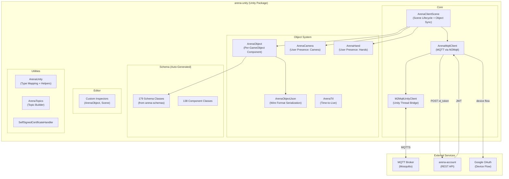
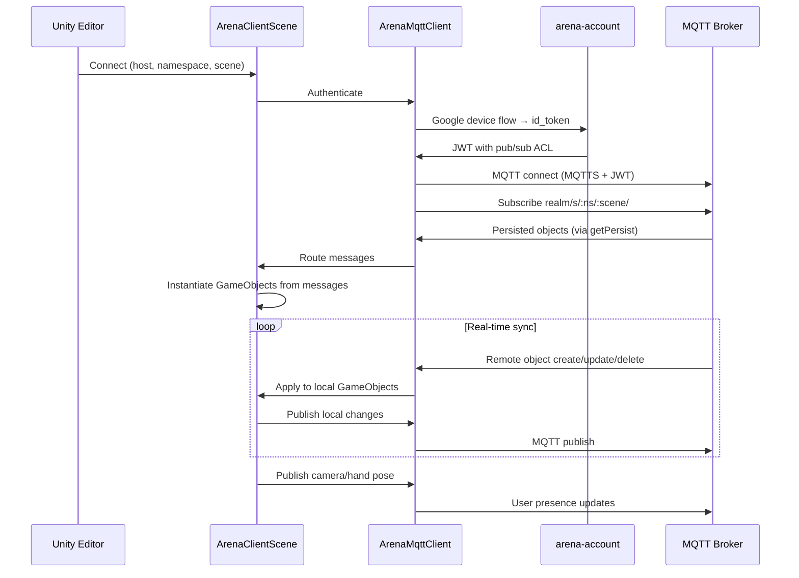

# ARENA Unity (arena-unity) — Requirements & Architecture

> **Purpose**: Machine- and human-readable reference for the ARENA Unity C# SDK's features, architecture, and source layout.

## Architecture

## Source File Index

| File / Directory | Role | Key Symbols |
|------------------|------|-------------|
| [Runtime/ArenaClientScene.cs](Runtime/ArenaClientScene.cs) | Scene lifecycle, object sync, MQTT message routing | `ConnectArena`, `DisconnectArena`, `PublishObject`, `CreateUpdateObject`, `RemoveObject` |
| [Runtime/ArenaMqttClient.cs](Runtime/ArenaMqttClient.cs) | MQTT connection, auth flow, message publish/subscribe | `Connect`, `Publish`, `Subscribe`, `ProcessMqttEvents` |
| [Runtime/M2MqttUnityClient.cs](Runtime/M2MqttUnityClient.cs) | Unity main-thread bridge for M2Mqtt | `Update` loop, message queue |
| [Runtime/ArenaObject.cs](Runtime/ArenaObject.cs) | Per-GameObject component for ARENA sync | `PublishCreateUpdate`, `PublishRemove`, `ApplyCreate`, `ApplyUpdate` |
| [Runtime/ArenaObjectJson.cs](Runtime/ArenaObjectJson.cs) | Wire format JSON serialization | JSON ↔ C# object mapping |
| [Runtime/ArenaCamera.cs](Runtime/ArenaCamera.cs) | User camera presence publishing | camera pose updates |
| [Runtime/ArenaHand.cs](Runtime/ArenaHand.cs) | User hand presence publishing | controller pose updates |
| [Runtime/ArenaTopics.cs](Runtime/ArenaTopics.cs) | MQTT topic construction | scene/object/user topic patterns |
| [Runtime/ArenaUnity.cs](Runtime/ArenaUnity.cs) | Utilities, type mapping, coordinate conversion | A-Frame ↔ Unity coordinate transforms |
| [Runtime/ArenaTtl.cs](Runtime/ArenaTtl.cs) | Time-to-live object management | auto-destroy after TTL |
| [Runtime/Schemas/](Runtime/Schemas/) | 179 auto-generated schema classes (from arena-schemas) | Wire format C# data classes |
| [Runtime/Components/](Runtime/Components/) | 138 component behavior classes | ARENA component ↔ Unity component mapping |
| [Runtime/ArenaMesh/](Runtime/ArenaMesh/) | Mesh import/export (34 files) | GLTF, OBJ, PCD handling |
| [Runtime/Packages/](Runtime/Packages/) | Third-party package integrations (119 files) | M2Mqtt, Newtonsoft.Json, etc. |
| [Runtime/Prefabs/](Runtime/Prefabs/) | Unity prefabs | ArenaClientScene prefab |
| [Editor/](Editor/) | Custom Unity Editor inspectors (44 files) | ArenaObject inspector, scene editor |
| [Samples~/](Samples~/) | Example scenes (62 files) | sample ARENA Unity projects |
| [Runtime/SelfSignedCertificateHandler.cs](Runtime/SelfSignedCertificateHandler.cs) | Self-signed certificate acceptance | TLS bypass for dev |

## Feature Requirements

### Scene Connection

| ID | Requirement | Source |
|----|-------------|--------|
| REQ-UN-001 | Scene connection with host, namespace, scene (Inspector-configurable) | [Runtime/ArenaClientScene.cs](Runtime/ArenaClientScene.cs) |
| REQ-UN-002 | Google OAuth device code flow authentication | [Runtime/ArenaMqttClient.cs](Runtime/ArenaMqttClient.cs) |
| REQ-UN-003 | JWT acquisition from arena-account REST API | [Runtime/ArenaMqttClient.cs](Runtime/ArenaMqttClient.cs) |
| REQ-UN-004 | MQTTS connection with JWT credentials | [Runtime/ArenaMqttClient.cs](Runtime/ArenaMqttClient.cs) |
| REQ-UN-005 | Self-signed certificate support for development | [Runtime/SelfSignedCertificateHandler.cs](Runtime/SelfSignedCertificateHandler.cs) |

### Object Synchronization

| ID | Requirement | Source |
|----|-------------|--------|
| REQ-UN-010 | Real-time object sync: MQTT messages ↔ Unity GameObjects | [Runtime/ArenaClientScene.cs](Runtime/ArenaClientScene.cs), [Runtime/ArenaObject.cs](Runtime/ArenaObject.cs) |
| REQ-UN-011 | Create/update/delete lifecycle from remote MQTT messages | [Runtime/ArenaObject.cs](Runtime/ArenaObject.cs) |
| REQ-UN-012 | Publish local GameObject changes to MQTT | [Runtime/ArenaObject.cs#PublishCreateUpdate](Runtime/ArenaObject.cs) |
| REQ-UN-013 | Schema-generated C# classes for wire format (from arena-schemas) | [Runtime/Schemas/](Runtime/Schemas/) |
| REQ-UN-014 | Component mapping: ARENA schema components ↔ Unity components | [Runtime/Components/](Runtime/Components/) |
| REQ-UN-015 | Coordinate system conversion (A-Frame right-hand ↔ Unity left-hand) | [Runtime/ArenaUnity.cs](Runtime/ArenaUnity.cs) |

### User Presence

| ID | Requirement | Source |
|----|-------------|--------|
| REQ-UN-020 | Camera pose publishing (position, rotation) | [Runtime/ArenaCamera.cs](Runtime/ArenaCamera.cs) |
| REQ-UN-021 | Hand/controller pose publishing | [Runtime/ArenaHand.cs](Runtime/ArenaHand.cs) |
| REQ-UN-022 | Remote user avatar rendering | [Runtime/ArenaClientScene.cs](Runtime/ArenaClientScene.cs) |

### Mesh & Models

| ID | Requirement | Source |
|----|-------------|--------|
| REQ-UN-030 | GLTF model import/export | [Runtime/ArenaMesh/](Runtime/ArenaMesh/) |
| REQ-UN-031 | Gaussian Splatting model support | [Runtime/Components/](Runtime/Components/) |
| REQ-UN-032 | TTL (time-to-live) auto-destroy | [Runtime/ArenaTtl.cs](Runtime/ArenaTtl.cs) |

### Editor Integration

| ID | Requirement | Source |
|----|-------------|--------|
| REQ-UN-040 | Custom Inspector for ArenaObject (component editor, sync controls) | [Editor/](Editor/) |
| REQ-UN-041 | Scene connection UI in Editor | [Editor/](Editor/) |
| REQ-UN-042 | Persistence flag management in Inspector | [Editor/](Editor/) |

## Supported Entities

> See also: [arena-web-core](https://github.com/arenaxr/arena-web-core/blob/master/REQUIREMENTS.md#supported-entities) · [arena-py](https://github.com/arenaxr/arena-py/blob/master/REQUIREMENTS.md#supported-entities)

| Entity | Arena ➡ Unity | Unity ➡ Arena | Description |
|---|---|---|---|
| `arenaui-button-panel` | - | - | Flat UI displays a vertical or horizontal panel of buttons |
| `arenaui-card` | - | - | Flat UI displays text and optionally an image |
| `arenaui-prompt` | - | - | Flat UI displays prompt with button actions |
| `box` | ✅ 0.0.1 | ✅ | Box geometry |
| `capsule` | ✅ 0.0.12 | ✅ | Capsule geometry |
| `circle` | ✅ 0.0.11 | ✅ | Circle geometry |
| `cone` | ✅ 0.0.11 | ✅ | Cone geometry |
| `cylinder` | ✅ 0.0.1 | ✅ | Cylinder geometry |
| `dodecahedron` | ✅ 0.0.12 | ✅ | Dodecahedron geometry |
| `entity` | ✅ 0.0.1 | ✅ | Entities are the base of all objects in the scene |
| `env-presets` | - | - | A-Frame Environment and presets |
| `gaussian_splatting` | ✅ 1.3.0 | - | Load a Gaussian Splat model |
| `gltf-model` | ✅ 0.0.2 | ✅ manual export | Load a GLTF model |
| `icosahedron` | ✅ 0.0.11 | ✅ | Icosahedron geometry |
| `image` | ✅ 0.0.7 | ✅ | Display an image on a plane |
| `light` | ✅ 0.0.5 | ✅ | A light |
| `line` | ✅ 0.9.0 | - | Draw a line |
| `obj-model` | ✅ 1.4.0 | - | Load an OBJ model |
| `ocean` | - | - | Oceans, water |
| `octahedron` | ✅ 0.0.11 | ✅ | Octahedron geometry |
| `pcd-model` | - | - | Load a PCD model |
| `plane` | ✅ 0.0.1 | ✅ | Plane geometry |
| `post-processing` | - | - | Visual effects enabled in desktop and XR views |
| `program` | ❌ | - | ARENA program data |
| `renderer-settings` | - | - | THREE.js WebGLRenderer properties |
| `ring` | ✅ 0.0.11 | ✅ | Ring geometry |
| `roundedbox` | - | ✅ | Rounded Box geometry |
| `scene-options` | - | - | ARENA Scene Options |
| `sphere` | ✅ 0.0.1 | ✅ | Sphere geometry |
| `tetrahedron` | ✅ 0.0.12 | ✅ | Tetrahedron geometry |
| `text` | ✅ 0.3.0 | ✅ | Display text |
| `thickline` | ✅ 0.4.0 | ✅ | Draw a line that can have a custom width |
| `threejs-scene` | - | - | Load a THREE.js Scene |
| `torus` | ✅ 0.0.11 | ✅ | Torus geometry |
| `torusKnot` | ✅ 0.10.2 | ✅ | Torus Knot geometry |
| `triangle` | ✅ 0.0.12 | ✅ | Triangle geometry |
| `urdf-model` | - | - | Load a URDF model |
| `videosphere` | ❌ | ✅ | Videosphere 360 video |

## Supported Components

> See also: [arena-web-core](https://github.com/arenaxr/arena-web-core/blob/master/REQUIREMENTS.md#supported-components) · [arena-py](https://github.com/arenaxr/arena-py/blob/master/REQUIREMENTS.md#supported-components)

| Component | Arena ➡ Unity | Unity ➡ Arena | Description |
|---|---|---|---|
| `animation` | ✅ 1.6.0 | - | Animate and tween values |
| `animation-mixer` | ✅ 0.7.0 | - | Play animations in model files |
| `arena-camera` | ✅ 0.11.0 | ✅ | Tracking camera movement, emits pose updates |
| `arena-hand` | - | ✅ | Tracking VR controller movement, emits pose updates |
| `arena-user` | ✅ 0.11.0 | - | Another user's camera, renders Jitsi/displayName updates |
| `armarker` | - | - | Location marker for scene anchoring in the real world |
| `attribution` | - | - | Saves attribution data in any entity |
| `blip` | - | - | Objects animate in/out of the scene |
| `box-collision-listener` | ✅ 1.6.0 | ✅ | AABB collision detection for entities with a mesh |
| `buffer` | ❌ | - | Transform geometry into a BufferGeometry |
| `click-listener` | ✅ 0.8.0 | ✅ | Track mouse events and publish corresponding events |
| `collision-listener` | - | - | Listen for collisions, callback on event |
| `geometry` | ✅ 0.10.0 | - | Primitive mesh geometry support |
| `gesture-detector` | - | - | Detect multi-finger touch gestures |
| `gltf-model-lod` | - | - | GLTF LOD switching based on distance |
| `gltf-morph` | - | - | GLTF 3D morphable model controls |
| `goto-landmark` | - | - | Teleports user to landmark |
| `goto-url` | - | - | Navigate to given URL |
| `hide-on-enter-ar` | - | - | Hide object when entering AR |
| `hide-on-enter-vr` | - | - | Hide object when entering VR |
| `jitsi-video` | ❌ | - | Apply Jitsi video source to geometry |
| `landmark` | ❌ | - | Define entities as landmarks for navigation |
| `look-at` | - | - | Dynamically rotate to face another entity or position |
| `material` | ✅ 0.0.10 | ✅ | Material properties of the object's surface |
| `material-extras` | - | - | Extra material properties: encoding, render order |
| `model-container` | - | - | Override absolute size for a 3D model |
| `modelUpdate` | - | - | Manually manipulate GLTF child components |
| `multisrc` | - | - | Define multiple visual sources for an object |
| `parent` | ✅ 0.0.7 | ✅ | Parent's object_id; child inherits scale and translation |
| `physx-body` | ✅ 1.6.0 | - | PhysX rigid body (replaces deprecated dynamic-body, static-body) |
| `physx-force-pushable` | ✅ 1.6.0 | - | Makes physx-body pushable by user (replaces deprecated impulse) |
| `physx-grabbable` | ✅ 1.6.0 | - | Allows user hands to grab/pickup physx-body objects |
| `physx-joint` | ✅ 1.6.0 | - | PhysX joint between rigid bodies |
| `physx-joint-constraint` | - | - | Adds constraint to a physx-joint |
| `physx-joint-driver` | - | - | Creates driver to return joint to initial position |
| `physx-material` | ✅ 1.6.0 | - | Controls physics properties for shapes or bodies |
| `position` | ✅ 0.0.1 | ✅ | 3D object position |
| `remote-render` | ✅ 0.10.1 | - | Whether or not an object should be remote rendered |
| `rotation` | ✅ 0.0.1 | ✅ | 3D object rotation in quaternion (right-hand coordinate system) |
| `scale` | ✅ 0.0.1 | ✅ | 3D object scale |
| `screenshareable` | ❌ | - | Allows an object to be screenshared upon |
| `shadow` | ✅ 0.0.10 | - | Whether the entity casts/receives shadows |
| `show-on-enter-ar` | - | - | Show object when entering AR |
| `show-on-enter-vr` | - | - | Show object when entering VR |
| `skipCache` | - | - | Disable retrieving shared geometry from cache |
| `sound` | - | - | Defines entity as a source of sound or audio |
| `spe-particles` | ✅ 1.5.0 | - | GPU based particle systems |
| `submodel-parent` | - | - | Attach to submodel components of model |
| `textinput` | - | - | Opens HTML prompt when clicked, sends text input as MQTT event |
| `video-control` | - | - | Adds video to entity and controls playback |
| `visible` | ✅ 0.10.1 | - | Whether or not an object should be rendered visible |

## Sync Flow

## Planned / Future

- Additional model format support
- Enhanced component mapping coverage
- Build pipeline improvements for contributor onboarding
